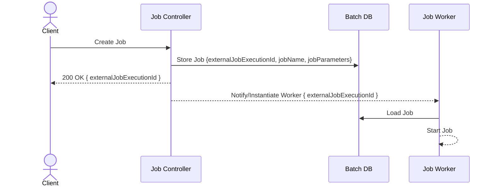
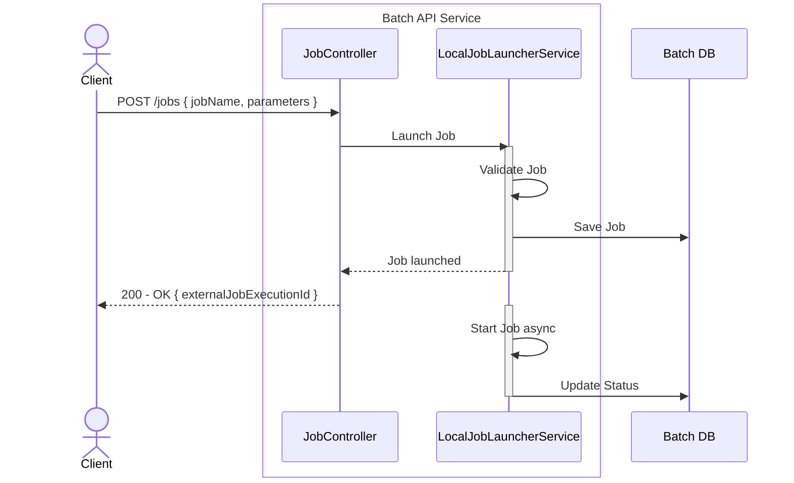
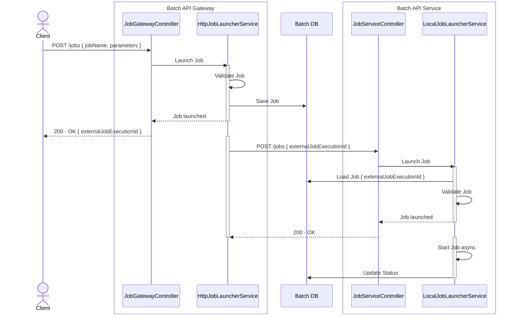
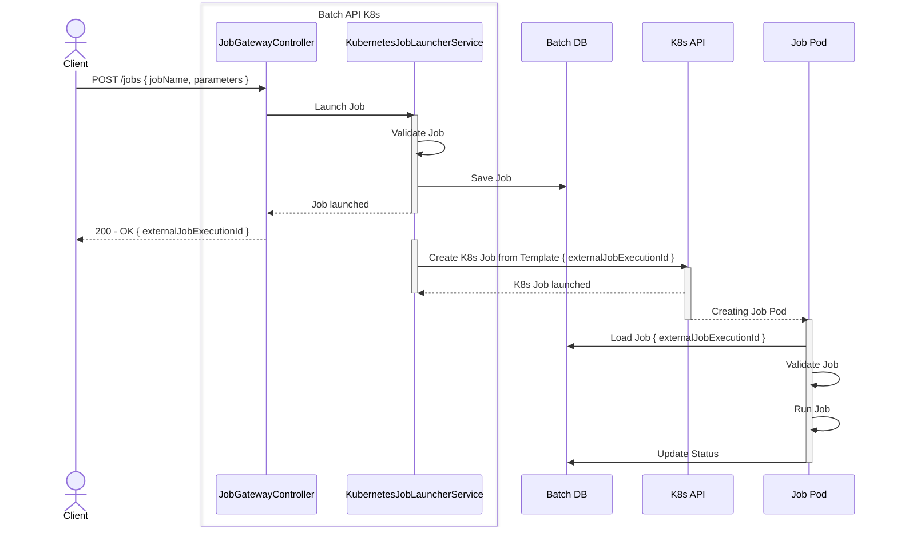
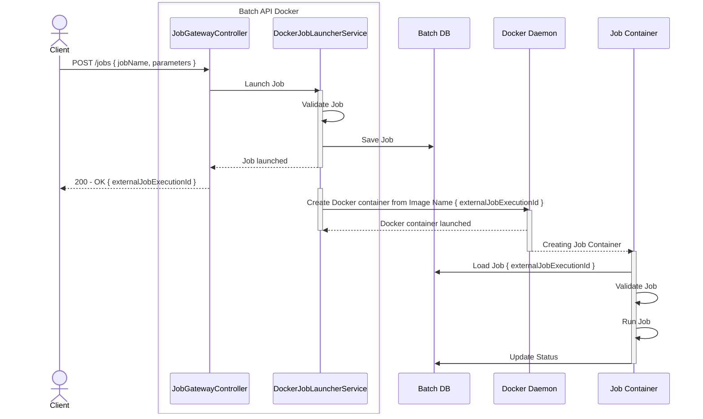

# Spring Batch Launcher API

This project is a technical example to explore and demonstrate different strategies for triggering and orchestrating Spring Batch jobs via an HTTP-based API.

The main goal is to identify suitable approaches to asynchronously trigger batch jobs through a REST API, leveraging a centralized batch job repository to manage and monitor job executions across various deployment scenarios.

---

### Architecture Overview

The Architecture is built on **Spring Batch** and explores different approaches to exposing batch job execution via an API, allowing dynamic, ad hoc triggering of jobs. The core idea is to provide a structured way to trigger and monitor batch jobs across various execution environments.

The **Job Controller** component is the entry point for job execution requests. When a client submits a job request, it is accepted and stored in the Database, ensuring that each job execution is tracked with a unique identifier.

From there, the actual job execution depends on the chosen deployment strategy. The system either notifies an existing **Job Worker** or instantiates a new execution environment:

- In **local execution**, the job runs in the same process as the API server.
- In **remote execution**, the API server delegates the request to a separate worker instance via HTTP.
- In **Kubernetes-based execution**, the API server dynamically instantiates a new Kubernetes job, ensuring full isolation.

Regardless of the execution strategy, all batch jobs rely on a **shared database**, ensuring job parameters and execution state are consistently accessible. This approach allows for a scalable and flexible architecture, enabling batch jobs to be executed efficiently in different environments.




### Comparison to Spring Cloud Data Flow

Spring Cloud Data Flow provides a similar capability, offering a generic API for triggering batch jobs, registering applications, and dynamically deploying jobs in Kubernetes. However, it is a **broader and more complex framework** designed for orchestrating both batch and streaming workloads.

In this example, we explore a **simplified approach** that focuses specifically on **Spring Batch job execution via HTTP**. By narrowing the scope to just exposing and managing batch jobs, it avoids the overhead of a fully-fledged orchestration framework. This serves as an alternative implementation for scenarios where the primary requirement is to trigger and monitor **Spring Batch jobs** without the additional complexity of event-driven data pipelines or extensive job coordination mechanisms.

## Delegation Strategies


### 1. Local Job Execution

This is the simplest approach. Batch jobs are executed asynchronously directly within the same API server instance that receives the request. No external components or additional communication is required.

#### Sequence Diagram




### 2. HTTP-Gateway Delegation

In this variant, the API server acts as an API gateway and delegates job execution requests via HTTP to registered remote "Batch Worker" instances. These workers implement the same REST API but run independently, potentially on different nodes.

- Each worker runs the job locally (like in variant 1).
- The API gateway dynamically resolves the appropriate worker instance based on job names using a configurable mapping.


#### Sequence Diagram




### 3. Kubernetes-based Job Execution

This implementation leverages Kubernetes to manage batch job executions dynamically.

Batch jobs are defined in advance within Kubernetes as YAML job templates, along with all required environment variables and configuration settings (e.g., secrets, data source credentials). These job templates exist as Kubernetes resources (ConfigMap). 

The server retrieves these predefined YAML templates via Kubernetes API and instantiates them dynamically. 

Here is an example of a pre-configured K8s Job template:

```yaml
apiVersion: v1
kind: ConfigMap
metadata:
  name: greeting-job-template
data:
  job.yaml: |
    apiVersion: batch/v1
    kind: Job
    metadata:
      name: greeting-job
    spec:
      template:
        spec:
          containers:
            - name: greeting
              image: app-shell-greeting-local:latest
              imagePullPolicy: Never
              envFrom:
                - configMapRef:
                    name: greeting-job-config
          restartPolicy: Never
```


NOTE: Kubernetes does not allow creation of Jobs without immediately starting them. Thus, the "hack" to configure the job-template via a Config Map.

For more information, see [K8s Deployment README](deployments/kubernetes/README.md).

#### Sequence Diagram




### 4. Docker-based Job Execution

This implementation leverages Docker to manage batch job executions dynamically.

Since we are using docker compose for building the applications, we first need to build the images to make them available in the docker Daemon.

After that the API server can start with the configuration information about the containers to start.

The configuration of the container environment variables is configured in the `docker-compose.yaml` that contains the API server and the registration of the remote docker jobs:

```yaml
  app-http-docker:
    build:
      context: ../../sample/apps/app-http-docker/
      dockerfile: Dockerfile
    image: app-http-docker
    environment:
      SPRING_DATASOURCE_URL: jdbc:postgresql://postgres:5432/postgres
      SPRING_DATASOURCE_USERNAME: postgres
      SPRING_DATASOURCE_PASSWORD: postgres
      job.docker.configurations[0].job-name: greetingJob
      job.docker.configurations[0].docker-image-name: app-shell-greeting-local
      job.docker.configurations[0].spring-application-json: >
        {
          "spring": {
            "datasource": {
              "url": "jdbc:postgresql://postgres:5432/postgres",
              "username": "postgres",
              "password": "postgres"
            }
          }
        }
```

Additionally, the API server container needs to have access to the Docker deamon. In the example case, this is done by mounting the docker socket of the host into the container.

For more information, see [Docker Deployment README](deployments/docker/README.md).

#### Sequence Diagram




---
## Module Overview

- **batch-core**  
  Contains core interfaces and shared utilities used across multiple modules.

- **batch-extapi**  
  Defines the request and response POJOs for the external HTTP API.

- **batch-extservice**  
  Provides Spring MVC REST controllers to delegate job execution requests to different execution strategies and handle HTTP interactions.

- **batch-persistence**  
  Handles the persistence of the `AcceptedJob` entity. This module is used by different applications for both writing and reading job execution data.

- **Launcher Strategies**  
  Contains different job execution strategies:
    - **launcher-docker**: Dynamically starts Docker containers for batch execution.
    - **launcher-http**: Forwards job execution requests to another HTTP-Worker services (Job API Gateway).
    - **launcher-kubernetes**: Dynamically starts Kubernetes jobs for batch execution.
    - **launcher-local**: Executes the batch job locally within the application.

- **Job Modules (sample/jobs)**  
  Contain specific Spring Batch job implementations:
    - **job-bill**: Example batch job that writes billing data into the database.
    - **job-greeting**: Simple batch job that prints a greeting message to the console.

- **Sample Apps (sample/apps)**  
  Spring Boot applications demonstrating different execution strategies:
    - **app-http-docker**: HTTP server that forwards job execution to Docker.
    - **app-http-greeting-local**: HTTP server that executes the Greeting Job locally.
    - **app-http-kubernetes**: HTTP API server that forwards job execution to Kubernetes.
    - **app-http-proxy**: API Gateway that forwards job execution requests to registered HTTP worker services.
    - **app-shell-greeting-local**: Spring Boot application that executes the Greeting Job as an `ApplicationRunner`, used as a worker job in the Kubernetes example.